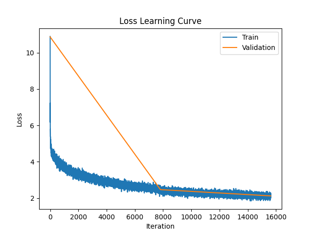

# CSC413 Final Project

Repository for the final project of CSC413.

### Table of Contents

- [Introduction](#introduction)
- [Model](#model)
- [Dataset](#dataset)
- [Training Curve](#training-curve)
- [Hyperparameter Tuning](#hyperparameter-tuning)
- [Quantitative Measures](#quantitative-measures)
- [Quantitative and Qualitative Results](#quantitative-and-qualitative-results)
- [Justification of Results](#justification-of-results)
- [Ethical Consideration](#ethical-consideration)
- [Authors](#authors)
- [License](#license)
  
# Introduction 

We will create a model that is capable of summarizing text. We aim to perform summarization that is abstractive instead of extractive, meaning that the model will try to generate a paraphrasing of the input data instead of just highlighting key points by extracting them from the input. We used a dataset of Arxiv scientific research papers. 

We are planning on making our proof of concept by creating a model that, given an abstract of a scientific paper, will predict the title of the paper. This proof of concept will show that our model is capable of learning and handling this task, and can be further extended to work with entire papers as input to produce the abstract of the paper given more time and computing resources.

To achieve this, we will use a Transformer model (encoder and decoder) where the abstract text sequence will tokenized and passed into the encoder, and the encoder output will be decoded by the decoder (using self-attention) to generate the output tokens that are then converted into the predicted title text sequence.

# Model

For this task, we trained a PyTorch Transformer model from scratch (both encoder and decoder).

### Model Figure

This Transformer model is based on the paper [Attention Is All You Need](https://arxiv.org/pdf/1706.03762.pdf).
An annotated diagram from the paper illustrating our model can be found below:

<p align="center">
   </br>
  <p align="center">
  Source: <a href="https://arxiv.org/pdf/1706.03762.pdf">Attention Is All You Need</a>
  </p>
</p>

Our model first embeds the input token in low-dimensional space using an Embedding layer (embedded in 512 dimensions), and then sums it with the classic Positional Encoding from the paper (sinusoidal encoder) to encode information about token positions in the sequence.

This is then passed into encoder (input dimension of 512) which uses the multi-head self-attention mechanism with 8 heads, then into a feedforward network with output dimension of 1024, with skip residual connections. We have this encoder sub-layer stacked 4 times. 

We then have a stack of 4 decoder sub-layers with input dimension of 512 that are identical to the encoder layers, except they also include a third sub-layer which performs multi-head attention with 8 heads over the output of the encoder stack which is then fed into a feedforward network with output dimension of 1024. Similar to the encoder layers, there are skip residual connections. When attending to the expected outputs, a masking matrix is used to prevent the decoder from attending to tokens that are at a future timestep (which would be cheating). The output of this decoder stack is then finally passed into a feedforward network with output dimension of 30,000 - which is the size of our vocabulary and softmaxed to get the final prediction probabilities.

A detailed computation graph image (generated using [torchviz](https://github.com/szagoruyko/pytorchviz)) of a single forward pass of our model can be found at this [link](https://raw.githubusercontent.com/sharvenp/csc413-Final-Project/main/README_FILES/transformer_torchviz.png?token=GHSAT0AAAAAABRXQBYKWLKA3MSP7WSZCAFGZB5TKZA).

### Model Parameters

Using the following code, we can count the total and trainable parameters in the model:

```python
# Count all elements in model parameters
total_params = sum(param.numel() for param in model.parameters())

# Count all elements in model parameters that require grad
trainable_params = sum(p.numel() for p in model.parameters() if p.requires_grad)

print(f"Total Parameters: {total_params}")
print(f"Trainable Parameters: {trainable_params}")
```

Running this on our model, we get the following output:

```
Total Parameters: 67138864
Trainable Parameters: 67138864
```

Hence the total number of trainable parameters in our model is 67,138,864 which is the same as the total number of parameters. This is the case because all parts of our Transformer model are trainable (this includes the embeddings, positional encoder, and encoder/decoder sub-layers) and we are not using transfer learning or layers with freezed parameters.

### Model Examples

Examples from the test set:

Successful:
- Input: `in the paper a problem of risk measures on a discrete-time market model with transaction costs is studied. strategy effectiveness and shortfall risk is introduced. this paper is a generalization of quantile hedging presented in [4].`
- Expected Output: `quantile hedging on markets with proportional transaction costs`
- Predicted Output: `quantile hedging on discrete-time markets with transaction costs`

As we can see, the model is mostly successful with producing a paraphrasing of the abstract in the form of a title. This example works well because the abstract is relatively short.

Unsuccessful:
- Input: `in contrast to its chargeless version the charged banados, taitelboim and zanelli (btz) metric in linear maxwell electromagnetism is known to be singular at r=0. we show, by employing nonlinear electrodynamics that one obtains charged, extension of the btz metric with regular electric field. this we do by choosing a logarithmic lagrangian for the nonlinear electrodynamics. a theorem is proved on the existence of electric black holes and combining this results with a duality principle disproves the existence of magnetic black holes in 2+1-dimensions.`
- Expected Output: `revisiting the charged btz metric in nonlinear electrodynamics`
- Predicted Output: `charged banados and taitos's charged black holes in linear maxwell electromagnetism`

Despite the predicted sequence being completely different from the expected sequence, it seems that the model was able to provide somewhat of a extractive paraphrasing of the abstract. Since the task of paraphrasing scientific papers into a simple title requires knowledge of advanced scientific concepts, we have observed that the model sometimes fails to capture the meaning of the terms it is using as seen in the example above. 

# Dataset

### Data Source
For our model we will be using the dataset "[arxiv-abstracts-2021](https://huggingface.co/datasets/gfissore/arxiv-abstracts-2021)" from hugging face. We plan on using the titles as the correct prediction and the abstracts as the inputs. The dataset is licensed under [Creative Commons CC0 1.0 Universal Public Domain Dedication](https://creativecommons.org/publicdomain/zero/1.0/), thus we are allowed to use it for our project. 

Below a Sample datapoint is provided:
```
{
  "id": "supr-con/9609004",
  "submitter": "Masanori Ichioka",
  "authors": "Naoki Enomoto, Masanori Ichioka and Kazushige Machida (Okayama Univ.)",
  "title": "Ginzburg Landau theory for d-wave pairing and fourfold symmetric vortex\n  core structure",
  "comments": "12 pages including 8 eps figs, LaTeX with jpsj.sty & epsfig",
  "journal-ref": "J. Phys. Soc. Jpn. 66, 204 (1997).",
  "doi": "10.1143/JPSJ.66.204",
  "abstract": "  The Ginzburg Landau theory for d_{x^2-y^2}-wave superconductors is\nconstructed, by starting from the Gor'kov equation with including correction\nterms up to the next order of ln(T_c/T). Some of the non-local correction terms\nare found to break the cylindrical symmetry and lead to the fourfold symmetric\ncore structure, reflecting the internal degree of freedom in the pair\npotential. Using this extended Ginzburg Landau theory, we investigate the\nfourfold symmetric structure of the pair potential, current and magnetic field\naround an isolated single vortex, and clarify concretely how the vortex core\nstructure deviates from the cylindrical symmetry in the d_{x^2-y^2}-wave\nsuperconductors.\n",
  "report-no": null,
  "categories": [
    "supr-con cond-mat.supr-con"
  ],
  "versions": [
    "v1"
  ]
}

```


Dataset Citation: 
```
@misc{clement2019arxiv,
    title={On the Use of ArXiv as a Dataset},
    author={Colin B. Clement and Matthew Bierbaum and Kevin P. O'Keeffe and Alexander A. Alemi},
    year={2019},
    eprint={1905.00075},
    archivePrefix={arXiv},
    primaryClass={cs.IR}
}
```

### Data Summary 
The dataset consists of arxiv metadata (i.e. title, abstract, author, etc.) for 1,999,486 published papers. Statistical analysis of the dataset provides insight into the characteristics of the data. The average title length is 9.7 words long with a standard deviation of 3.7, whereas the average abstract length is 135.7 words long with a standard deviation of 63.9. As the standard deviation is relatively large for both the titles and abstracts it’s clear that there is a skew in the data, which is confirmed by histograms of the word counts (see histograms below). This indicates that the model will have to be robust to large differences in the input sequence length.

Further analysis shows that the datasets consist of papers from 176 unique arxiv categories. However, the distribution of these categories is unbalanced, with almost 78% of the papers belonging to the general category of physics. This bias will likely influence how well our model will generalize to other fields, especially due to the high-use of field specific jargon found in physic papers' titles and abstracts. Furthermore, many papers in science fields will often use latex syntax to format expressions. Its important to capture this information and the steps to do this will be outlined in the data transformation section.

Finally, the vocabulary of the dataset’s titles consists of 430,003 unique words. Moreover, the vocabulary of the dataset’s abstracts consist of 2,319,838 unique words. It is important to note that many of the unique words are field-specific jargon which will likely only be used in a few related papers. We must ensure that these outliers do not cause the model to perform poorly due to the inclusion of unrelated words in a predicted title.

Histogram of title word count:


Histogram of abstract word count:


### Data Transformation
Due to the size of the dataset, the data is preprocessed and tokenized. This allows for a significant improvement of training time as a loaded batch can be fed directly into the encoder of the transformer. The steps taken to accomplish this is outlined below.

1. Clean the base data: First, the relevant data from each datapoint must be extracted. This is as simple as retrieving each datapoint's title and abstract from the base JSON file and writing them to a new file. Each pair of lines is a single datapoint with the first line being the title and the second line being the abstract. Note, basic preprocessing is done to normalize all the characters to lower case. An example of such a file with two datapoints is displayed below:
```
calculation of prompt diphoton production cross sections at tevatron and lhc energies
a fully differential calculation in perturbative quantum chromodynamics is presented for the production of massive photon pairs at hadron colliders. all next-to-leading order perturbative contributions from quark-antiquark, gluon-(anti)quark, and gluon-gluon subprocesses are included, as well as all-orders resummation of initial-state gluon radiation valid at next-to-next-to-leading logarithmic accuracy. the region of phase space is specified in which the calculation is most reliable. good agreement is demonstrated with data from the fermilab tevatron, and predictions are made for more detailed tests with cdf and do data. predictions are shown for distributions of diphoton pairs produced at the energy of the large hadron collider (lhc). distributions of the diphoton pairs from the decay of a higgs boson are contrasted with those produced from qcd processes at the lhc, showing that enhanced sensitivity to the signal can be obtained with judicious selection of events.
sparsity-certifying graph decompositions
we describe a new algorithm, the $(k,\ell)$-pebble game with colors, and use it obtain a characterization of the family of $(k,\ell)$-sparse graphs and algorithmic solutions to a family of problems concerning tree decompositions of graphs. special instances of sparse graphs appear in rigidity theory and have received increased attention in recent years. in particular, our colored pebbles generalize and strengthen the previous results of lee and streinu and give a new proof of the tutte-nash-williams characterization of arboricity. we also present a new decomposition that certifies sparsity based on the $(k,\ell)$-pebble game with colors. our work also exposes connections between pebble game algorithms and previous sparse graph algorithms by gabow, gabow and westermann and hendrickson.
```

2. Tokenization: Now that a normalized corpus of text has been created, a tokenizer can be created and utilized. Rather then using a pre-trained tokenizer (eg. ChatGPT BPE tokenizer, SentencePiece), we chose to train our own tokenizer in a hope to capture more of the field/paper specific terms in the model's vocabulary. The exact tokenizer used can vary, however, we chose to use the library [YouTokenToMe](https://github.com/VKCOM/YouTokenToMe) which allows for fast parallel unsupervised training of a tokenizer. In our configuration the tokenizer utilizes Byte-Pair Encoding and a vocab size of 30k. This method balances the inclusion of full words, word fragments, and characters to ensure words never encountered by the tokenizer/model can still be embedded.

3. Final Dataset: Now that a tokenizer has been trained, the data is to be tokenized and formatted. To begin, the corpus created in step 1 is loaded into memory and batch tokenized, resulting in a list of list. Each nested list contains the index-tokens for a given title/abstract. The list is then iterated two indices at a time for each title/abstract pair. The length of the tokenized title and abstract are checked to ensure datapoints with lengths exceeding the model's maximum are discarded. Each encoding list is then padded with the padding token to the input/output length. Finally, each data point (title/abstract pair) is further nested into their own list such that index 0 contains the encoded title and index 1 contains the encoded abstract. Once the data has been fully processed, it is transformed into a numpy ndarray of shape `[datasize, 2, (max title length, max abstract length)]` and pickled for fast loading during training. 

### Data Split

After data transformation, we had a dataset with 1,763,097 examples. The data was filtered so that the maximum abstract length was set to 300 and the maximum title length was set to 20 - we found that this resulted in a reasonably sized dataset batches that fit in GPU memory.

Due to memory contraints as well as training time constraints, we decided to limit the training dataset size to 1,000,000 examples (57%) of dataset, used around 5000 examples for the validation dataset (0.3%) and around 10,000 examples for the test dataset (0.6%). We used a small validation set to be able to quickly calculate the validation loss during the training time and use it as an indicator of overfitting. We also used a reasonably sized test dataset so we can mostly accurately assess the model's performance on new examples, but were unable to use a larger dataset since the quantitative measure (ROUGE scores) calculation is time intensive since it needs to compare the position of unigrams, bigrams, and subsequences between the predicted and expected sequence. Moreover, the validation and test data loader batch sizes were set to 32 because anything higher would not fit in the GPU memory. This greatly limited the amount of datapoints and training scope we could use in these partitions.

The exact counts of the datasets are specified below:

- Train dataset size: 1,000,000
- Val dataset size: 5289
- Test dataset size: 10,578

# Training Curve

The model was trained for 2 epochs (15,700 total iterations) using the standard Google Colab GPU. Due to memory constraints, the highest batch size we could use was 128 and we were only able to train for two epochs before being timed out by Google Colab.

The ADAM optimizer was used with Cross Entropy Loss as the loss metric. Below is the training curve which shows average loss per iteration (validation loss was calculated at the end of every epoch to speed up training - which is roughly every 7800 iterations):



# Hyperparameter Tuning

Due to memory as well as training time constraints, we were not able to train multiple models on the original dataset to tune hyperparameters. However when overfitting the model to a small dataset of 5000 examples, we were able to easily elimate some hyperparameter choices because they either performed poorly, or took too long to converge to a low enough training loss (and validation loss). Hyperparameters we needed to consider:

- Training Batch Size
- Learning Rate 
- Weight Decay (ADAM L2 Penalty)
- Gradient Clipping Maximum (Maximum magnitude of gradient before it is clipped)
- Embedding Dimension (Dimension for embedding for both encoder and decoder vocabulary embeddings)
- Transformer Hidden Dimension (Number of units in feedforward network model for both encoder and decoder layers)
- Transformer Attention Heads (Number of multihead attention models)
- Number of Transformer Encoder/Decoder Layers (Number of Sub-encoder/Sub-decoder layers in Encoder/Decoder)
- Dropout (Dropout rate for Positional Encoder Output)

Some options we experimented with:

Choice 1: (Did not overfit to dataset and failed to converge)

```
- Training Batch Size: 32
- Learning Rate: 1e-3
- Weight Decay: 0
- Gradient Clipping Maximum: 10
- Embedding Dimension: 128
- Transformer Hidden Dimension: 128
- Transformer Attention Heads: 4
- Transformer Encoder/Decoder Layers: 2
- Dropout: 0.5
```

Choice 2: (Converged too slowly and did not generalize well)
```
- Training Batch Size: 32
- Learning Rate: 1e-6
- Weight Decay: 1e-6
- Gradient Clipping Maximum: 2
- Embedding Dimension: 256
- Transformer Hidden Dimension: 512
- Transformer Attention Heads: 4
- Transformer Encoder/Decoder Layers: 2
- Dropout: 0.3
```

Choice 3: (Overgeneralized and was unable to learn)
```
- Training Batch Size: 64
- Learning Rate: 1e-4
- Weight Decay: 1e-5
- Gradient Clipping Maximum: 2
- Embedding Dimension: 1024
- Transformer Hidden Dimension: 2048
- Transformer Attention Heads: 4
- Transformer Encoder/Decoder Layers: 4
- Dropout: 0.2
```

**Choice 4: (Performed the best)**
```
- Training Batch Size: 128
- Learning Rate: 1e-4
- Weight Decay: 1e-5
- Gradient Clipping Maximum: 5
- Embedding Dimension: 512
- Transformer Hidden Dimension: 1024
- Transformer Attention Heads: 8
- Transformer Encoder/Decoder Layers: 4
- Dropout: 0.2
```

# Quantitative Measures

Since the output of our model is a text sequence, it is difficult to compare this against a ground-truth because the output could be similar in English meaning/syntax, but will be different in terms of actual token values (i.e. different ordering or tense of words) as seen in the unsuccessful model prediction above. Hence we need to compare the "quality" of the output against the expected output. The [ROUGE](https://en.wikipedia.org/wiki/ROUGE_(metric)) metric (stands for Recall-Oriented Understudy for Gisting Evaluation) is typically used to quantitatively measure quality in text summarization tasks. The ROUGE metric can be calculated in various ways. Some of them are:

- ROUGE-1: The overlap of unigrams (each word) between the system and reference summaries.
- ROUGE-2: The overlap of bigrams between the system and reference summaries.
- ROUGE-L: Longest Common Subsequence (LCS) based statistics. Longest common subsequence problem takes into account sentence-level structure similarity naturally and identifies longest co-occurring in sequence n-grams automatically.


Example calculations for these metrics can be found in this [article](https://medium.com/nlplanet/two-minutes-nlp-learn-the-rouge-metric-by-examples-f179cc285499). Here is a brief overview:

ROUGE-1: 
> Reference: **The** **cat** is on **the** mat.

> Sample: **The cat** and **the** dog

The 1-grams that match are the words "the", "cat", and "the". Precision is the measure of how many 1-grams are in the sample while Recall is the measure of how many 1-grams are in the reference. Both numbers are fractions . We get the F1 score using the following formula:

$F1 = \displaystyle 2 \cdot{{(precision \cdot recall)} \over {precision + recall}}$

So in this example, our precision is $3 \over 5$ as we have 3 1-grams and the sample is length 5. Similarly our recall is $3 \over 6$. Thus our final F1 score is $2 \cdot {{3 \over 5}\cdot{3 \over 6} \over {3 \over 5}+{3 \over 6}}$ $= 0.36$.

We can do the same thing for 2-grams called ROUGE-2. We only have a single 2-gram in the sample, the words "*the cat*" so our precision and recall are $1\over4$ and $1\over5$ respectively. This gives a final ROUGE-2-F1 score of $0.22$.

Another way to quantify samples is by comparing longest Common Subsequence, which is ROUGE-L. The subsequence is not consecutive however so in our example the LCS is 3. We calculate precision, recall, and F1 the same way as before. In this example we would get a ROUGE-L F1 score of $0.55$.

All of these metrics are ratios with respect to the output sequence length and as we can these metrics allow us to assess the quality of the predicted sequence compared to the expected output by measure word occurrences and subsequence overlap.

Rouge is an easy way to quantify how "good" the samples from our model are in comparison to the dataset. However it does suffer as it doesn't factor in semantics. For example synonyms will confuse the model. 

> Reference: They were handsome

> Sample: He was beautiful

These mean the same thing but we have no common words so rouge scores will be very low.

There are two measures used for model generated output, ROUGE which is what we used, and BLEU which is mainly used for machine translation. ROUGE F1 scores use both precision and recall to generate the final score while BLEU uses only precision . From existing literature most summarization models used ROUGE over BLEU so we made the same choice. 

# Quantitative and Qualitative Results

For our quantitative measure, we went with the three ROUGE metrics and the average batch values for the test dataset is as follows:

- ROUGE-1: **33** (0.325192318427971)
- ROUGE-2: **13** (0.13252754712395426)
- ROUGE-L: **30** (0.2957219944277001)

Rouge scores typically peak at 50 which is considered really good, and we can see that with just two epochs we were able to achieve a ROUGE-1 and ROUGE-L scores of 30. The ROUGE-1 score is the highest, meaning the model was able to mostly mention words (unigrams) that were expected in the predicted output, resulting in the higher score. However, the ROUGE-2 score is relatively low which indicates that word pairs (bigrams) do not match the expected output as closely. Comparing this with the ROUGE-1 score, it seems that the predicted output includes the expected words, but they are not adjacent to each other to form bigrams. Moreover, the high ROUGE-L score indicates that the predicted output mostly includes subsequences from the expected output. Since this was achieved with just two epochs, it shows that with longer training and more epochs, we can achieve even higher scores.

Some qualitative examples of the model output:

---
Model predicting a sequence similar to the expected sequence:

- Input: `we calculate the characteristics of interband hgte-cdhgte quantum-well infrared photodetectors (qwips). due to a small probability of the electron capture into the qws, the interband hgte-cdhgte qwips can exhibit very high photoconductive gain. our analysis demonstrates significant potential advantages of these devices compared to the conventional cdhgte photodetectors and the a$_3$b$_5$ heterostructures.`
- Expected Output:`interband infrared photodetectors based on hgte--cdhgte quantum-well heterostructure`
- Predicted Output: `interband characteristics of hgte-cgte quantum well photodetectors`
---
Model performing extractive summarization by identifying keywords, but not capturing the meaning:

- Input: `in this paper a list of $r$-matrices on a certain coupled lie algebra is obtained. with one of these $r$-matrices, we construct infinitely many bi-hamiltonian structures for each of the two-component bkp and the toda lattice hierarchies. we also show that, when such two hierarchies are reduced to their subhierarchies, these bi-hamiltonian structures are reduced correspondingly.`
- Expected Output: `$r$-matrices and hamiltonian structures for certain lax equations`
- Predicted Output: `bi-hamiltonian structures on the toda lattice`

---
Model issue where it repeats certain words:

- Input: `let {\\alpha}(s) be an arc on a connected oriented surface s in e3, parameterized by arc length s, with torsion {\\tau} and length l. the total square torsion f of {\\alpha} is defined by t=\\int_{0}^{l}\\tau ^{2}ds\\ $. . the arc {\\alpha} is called a relaxed elastic line of second kind if it is an extremal for the variational problem of minimizing the value of f within the family of all arcs of length l on s having the same initial point and initial direction as {\\alpha}. in this study, we obtain differential equation and boundary conditions for a relaxed elastic line of second kind on an oriented surface.`
- Expected Output: `intrinsic equations for a relaxed elastic line of second kind on an oriented surface`
- Predicted Output: `a relaxed relaxed elastic line on a oriented surface`

---
Model's prediction is very close to the expected prediction when the inputted abstract is short:

- Input: `if pi: m -> b is an onto smooth maximal rank map between complete riemannian manifolds m and b with bounded geometry, we prove sufficient conditions for m to be roughly isometric to the riemannian product fxb, where f is a fiber of m.`
- Expected Output: `maximal rank maps between riemannian manifolds with bounded geometry`
- Predicted Output: `on the maximal rank of products of riemannian manifolds`

---

We can clearly see from the model's predictions are significant and it has learned how to summarize abstracts into a title, however the summarization is almost always extractive instead of abstractive. It seems that the model is looking for keywords in the abstract which it mentions in the predicted title, indicating that it generates the title sequence by extracting out these keywords which it finds important. Moreover, when the abstract is short, it is able to better predict the title, indicating that the model may require more parameters to increase its long-term memory.


# Justification of Results

It is clear that the model is able to summarize abstracts by predicting the titles, however the predictions are almost always extractive summaries. That is, the model seems to identify keywords in the abstract and put them together in syntactically correct English, but the model does not seem to understand the meaning of the terms. 

This problem is difficult because to summarize research paper abstracts requires knowledge of the subject matter which can be learned by Transformer models (as evident by Large Language models such as GPT, BERT, LLaMA, etc.), but requires more model complexity as well as training resources. Our model only has 67M parameters and was only trained for two epochs which may have not been sufficient for the model to learn the underlying meaning of the terms being used in the abstract. With more attention heads as well as larger hidden layers within the Transformer encoder/decoder layers, the model may have been able to capture more features from the input abstracts and learn underlying meanings of the terms.

Moreover, our dataset was biased towards research papers in physics, resulting in our model being biased towards only summarizing abstracts using physics terms. Other fields may organize their abstracts differently or use the same terms that have different meanings, resulting in a poor summarization by our model.

Furthermore, the task of predicting the title from the abstract to learn how to summarize text may not be a good approach towards learning text summarization since the title will not always be a summarization of the abstract. An example of this that is in our dataset is the [Attention Is All You Need](https://arxiv.org/pdf/1706.03762.pdf) paper which shows how the title is a commentary of the abstract, but does not provide a high-level summarization of the abstract. Hence to better perform text summarization, we propose the task of predicting the abstract given the entire research paper as input.

In conclusion, it is clear that our Transformer model has learned to perform extractive text summarization and with more computing resources and model complexity, this model will be able to generate abstractive summaries as well. Moreover, with enough computing resources, the same model architecture (with more parameters) can be trained to summarize entire research papers to predict the abstract of the paper. 

# Ethical Consideration

Our model provides utility to two main groups of people. Those who are learning English, and academics trying to find papers for their own work. Our model is able to take in an abstract and generate a rough summary of it as one sentence. This can be used for English learners to grasp the main points of larger bodies of text in words that are more common. Researchers who are reading existing literature rarely have time to go over papers in their entirety so we believe that our model could aid them by giving summaries. We believe both of these groups can benefit from the model.

However there can be ethical issues that arise with these two uses. First for people learning nglish an incorrect summary or extracting the wrong ideas from an abstract can lead to issues. If the summary does not match the original the user may be given a false impression of the text or mislearn English as a whole. An example would be an article about correlation vs causation of two events, A and B, but our summary only captures causation of A and B. This is a false interpretation but our model may provide it, giving false information to the user. This is not good as it doesn't give the entire picture and loses details. Another example would be for academics. Since naturally our model will lose details in the summary it could cause papers that have details that would be helpful to be left out. For example if an abstract details black holes and their effects on time, our summary may only choose one of those topics, time or black holes.

The model has limitations as it does not have deep understanding of the topics and only gives short summaries in a reduced vocabulary. This will naturally lose detail from the original text. While this is fine for most summaries the model does not truly understand what is important information or not, and just picks up patterns it has learnt. If a new abstract is structured differently then we do not know how well the model will generalize.

Finally the dataset also matters a great deal. Our model is trained on papers on physics with only a minority on other fields. This can lead to issues mentioned above as other fields may structure their abstracts differently and important words in physics do not translate over or even have the same meaning in other fields. An example being the word inflation, in physics it can refer to the early universe shortly after the big bang, in economics it could refer to the reduced buying power of currency, and in medicine it could refer to wounds. Other concepts might also be misinterpreted, vacuum decay has nothing to do with vacuums people keep in their houses. 

All these are important ethical considerations for our model and its effect on its userbase.

# Authors 

Authors: Thomas Mayer, Ajitesh Misra, Sharven Prasad Dhanasekar

Work Split:

- Sharven & AJ: 
    - Worked together to create the transformer code (model, training, and testing code - along with placeholder data loading code)
    - Experimented with various hyperparam configurations to overfit the model to a small training dataset
    - Investigated quantitative measures for model (i.e., ROUGE, BLEU, etc.)
    - Wrote up about the ethics of the use of the model, in addition to model architecture and result interpretation
- Thomas:
    - Data processing/cleaning and implemented data loading code
    - Created tokenizier and vocabulary for the dataset
    - Wrote up about data statistics and processing

All members collaborated in training the model equally and the best or most promising model was chosen. Once we had a trained model, all members joined a Discord call to write up the final README file.

We used [HackMD.io](https://hackmd.io/) for real-time collaboration on the README file.

# License

We are using the MIT license for this project

[LICENSE.md](LICENSE.md)
